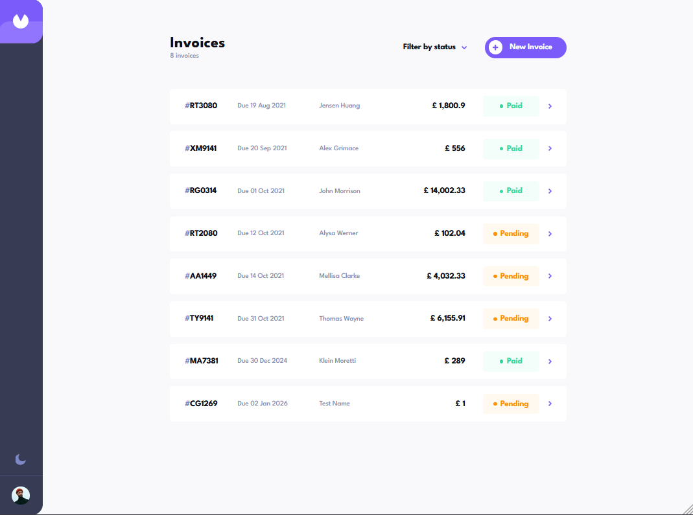
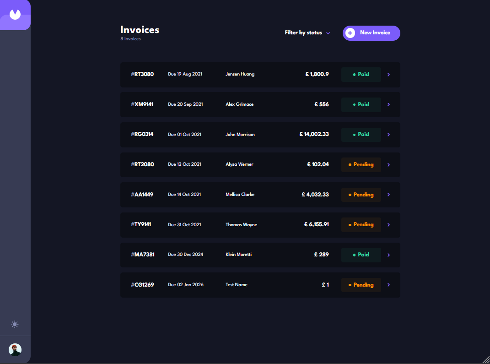
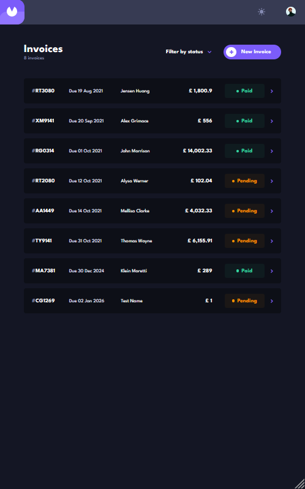
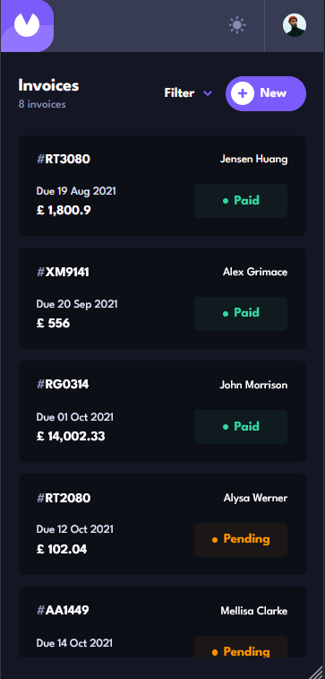

## Frontend Mentor

# Invoice App

A responsive invoice management application built as a solution to the Frontend Mentor Invoice App challenge.
Users can create, edit, view, and manage invoices with real-time form validation, persistent data storage, and a clean, accessible UI. The app supports both light and dark themes and adapts seamlessly across mobile, tablet, and desktop devices.

### Features

- Create, edit, view, and delete invoices
- Mark invoices as paid, pending, or draft
- Form validation using React Hook Form and Zod
- Confirmation dialog before deleting invoices
- Persistent invoice data using local storage
- Fully responsive layout for mobile, tablet, and desktop
- Light and dark theme toggle
- Accessible UI components built with Radix UI
- Centralized state management with Zustand
- Keyboard-accessible dialogs and controls
- Scrollable invoice form with fixed action buttons
- Computed totals and item-based pricing

### Built With

- React + Vite
- React Hook Form
- React Router
- Tailwind CSS
- Radix UI
- Zustand

### Getting Started

In order to setup and work on this project on your own, you will need to:

Clone this project: 
`git clone https://github.com/nofuenterr/invoice-app.git`

Once you have cloned this project, you can install the required dependencies by using: 
`npm install`

A live demo of the project can be started by using: 
`npm run preview`

Distribution files can be produced using: 
`npm run build`

### Credits/Acknowledgments

This project is for personal use only. I do not own any of the rights for the assets used in this project.

### Display

#### Laptop - Light

#### Laptop - Dark

#### Tablet

#### Phone

### To-do

- [ ] Add animations and transitions
- [ ] Fix icons clipping
- [ ] Make items list on view invoice a table on medium to large screen sizes
- [ ] Better content wrapping
- [ ] Header bar is visible and can be interacted with while invoice dialog is open
- [ ] Toast feature when adding or deleting invoices

---

Developed by **RR Nofuente**
