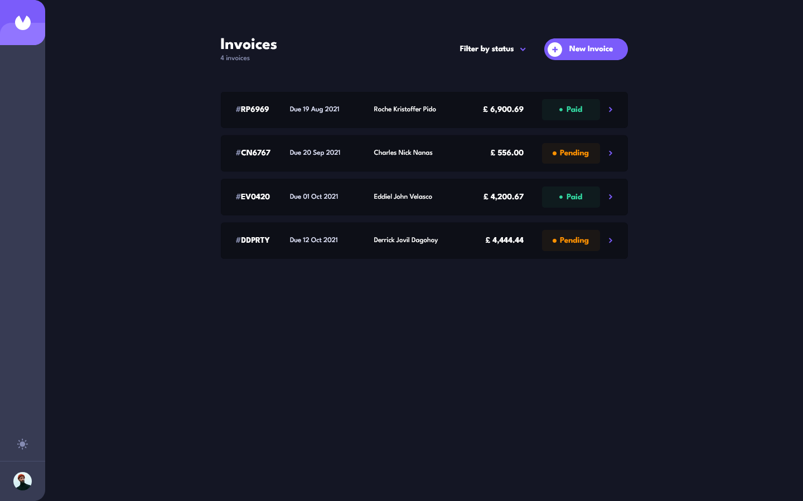
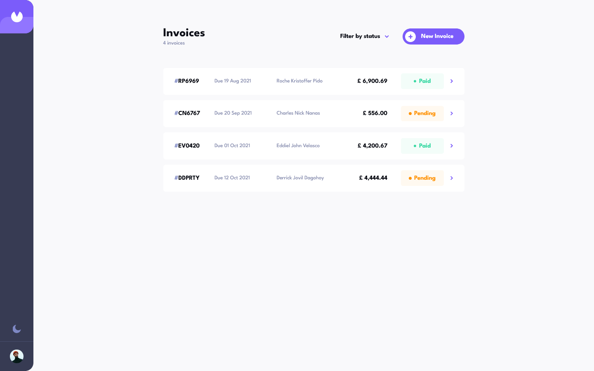
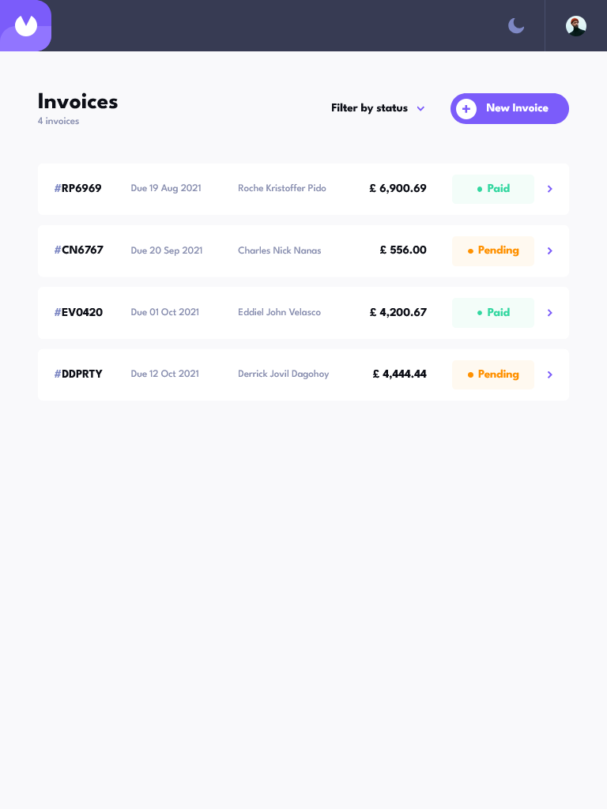
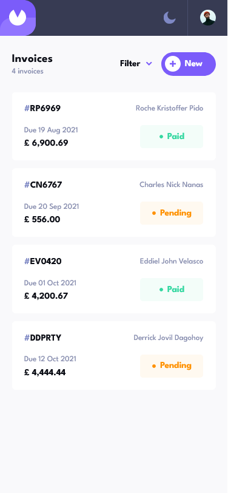
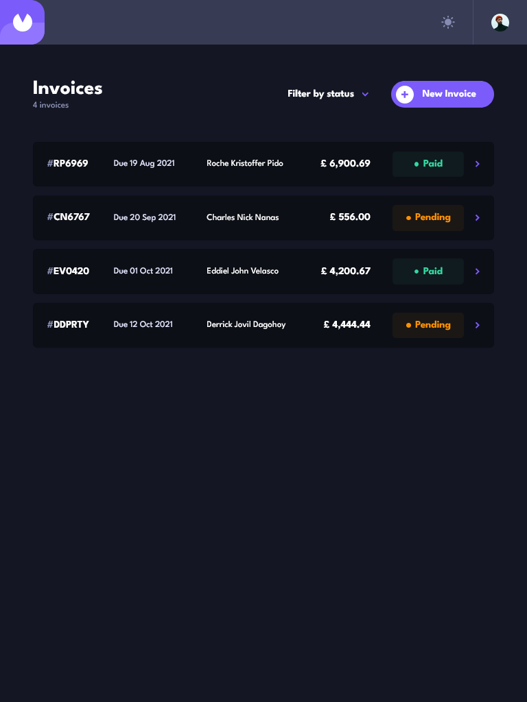
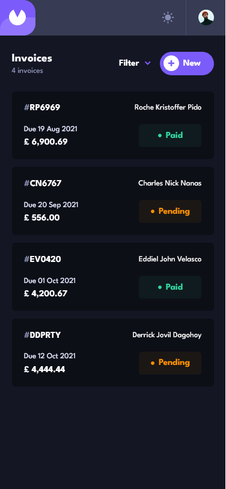

# Invoice App

> A responsive invoice management app — create, edit, and track invoices with light/dark theme support.



**Live Demo:** [invoice-app-sooty-nine.vercel.app](https://invoice-app-sooty-nine.vercel.app)

---

## Overview

Invoice App is a responsive invoice management tool built as a Frontend Mentor challenge. Users can create, edit, view, and delete invoices, mark their status as paid, pending, or draft, and filter by status. All data is stored locally so nothing is lost on refresh. The app supports both light and dark themes and works seamlessly across mobile, tablet, and desktop.

---

## Features

- Create, edit, view, and delete invoices
- Mark invoices as paid, pending, or draft
- Filter invoices by status
- Validated forms using React Hook Form and Zod
- Confirmation dialog before deleting
- Persistent data via local storage
- Computed totals and item-based pricing
- Light and dark theme toggle
- Fully responsive across mobile, tablet, and desktop
- Accessible and keyboard-navigable UI

---

## Tech Stack

| Category | Technology |
|---|---|
| Framework | React + Vite |
| Language | TypeScript |
| Styling | Tailwind CSS |
| Routing | React Router |
| Forms | React Hook Form + Zod |
| UI Components | Radix UI |
| State Management | Zustand |

---

## Getting Started

### Prerequisites

- Node.js `v18+`

### Installation

```bash
git clone https://github.com/nofuenterr/invoice-app.git
cd invoice-app
npm install
```

### Running the App

```bash
npm run preview
```

### Build

```bash
npm run build
```

---

## Screenshots

<table>
  <tr>
    <th colspan="3">Light Mode</th>
  </tr>
  <tr>
    <th>Desktop</th>
    <th>Tablet</th>
    <th>Mobile</th>
  </tr>
  <tr>
    <td></td>
    <td></td>
    <td></td>
  </tr>
</table>

<table>
  <tr>
    <th colspan="3">Dark Mode</th>
  </tr>
  <tr>
    <th>Desktop</th>
    <th>Tablet</th>
    <th>Mobile</th>
  </tr>
  <tr>
    <td></td>
    <td></td>
    <td></td>
  </tr>
</table>

---

## To-do

- [ ] Animations and transitions
- [ ] Fix icon clipping
- [ ] Items list as table on medium to large screens
- [ ] Better content wrapping on edge cases
- [ ] Prevent header interaction while invoice dialog is open
- [ ] Toast notifications on add/delete

---

## Credits

This project is a solution to a [Frontend Mentor](https://www.frontendmentor.io) challenge. I do not own the rights to any assets used.

---

*Developed by **RR Nofuente***